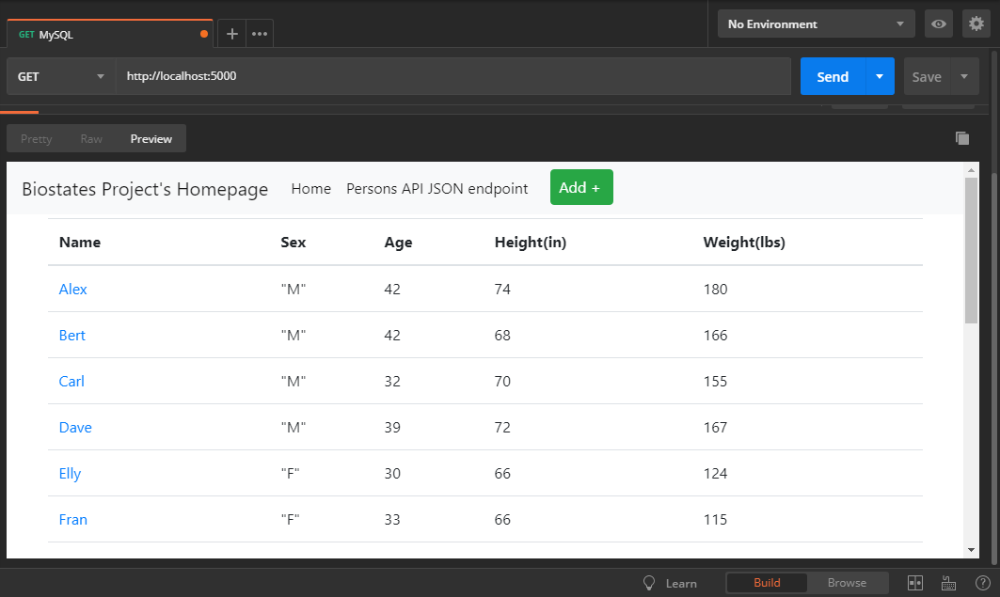

# Project Description
This project is a homework assignment to teach how to get Pycharm setup with Docker, Flask, MySQL, and Postman with database Inseret,Update,Delete and Retrieve operations.

# Postman Snapshot
